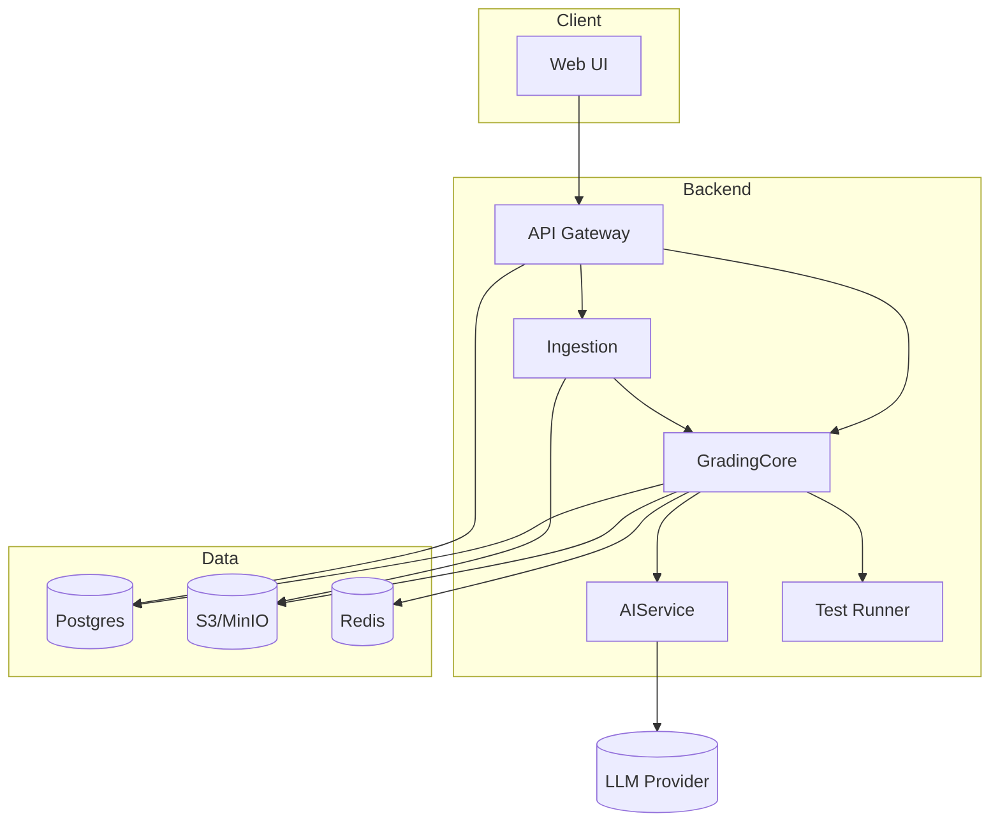

# C4 Диаграмма (Container Level)

```mermaid
flowchart TB
  subgraph Client
    UI[Web UI]
  end
  subgraph Backend
    API[API Gateway]
    Ingestion
    GradingCore
    AIService
    Sandbox[Test Runner]
  end
  subgraph Data
    DB[(Postgres)]
    ObjectStore[(S3/MinIO)]
    Cache[(Redis)]
  end
  UI --> API
  API --> Ingestion
  API --> GradingCore
  Ingestion --> GradingCore
  GradingCore --> Sandbox
  GradingCore --> AIService
  AIService --> LLM[(LLM Provider)]
  GradingCore --> DB
  GradingCore --> ObjectStore
  Ingestion --> ObjectStore
  API --> DB
  GradingCore --> Cache
```

## Примечания

- API может быть REST + WebSocket канал для статусов
- Redis используется для очередей и кэша AI ответов
