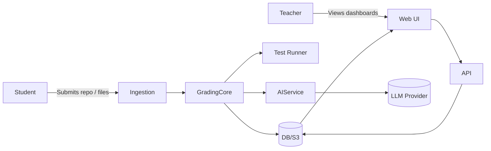

# C4 Диаграмма (Context Level)

```mermaid
flowchart LR
  Student -->|Submits repo / files| Ingestion
  Teacher -->|Views dashboards| UI[Web UI]
  UI --> API
  Ingestion --> GradingCore
  GradingCore --> Sandbox[Test Runner]
  GradingCore --> AIService
  AIService --> LLM[(LLM Provider)]
  GradingCore --> Storage[(DB/S3)]
  Storage --> UI
  API --> Storage
```

## Участники

- Student / Teacher — внешние пользователи
- LLM Provider — внешний сервис AI
- Storage — персистентный слой (Postgres + Object Storage)
