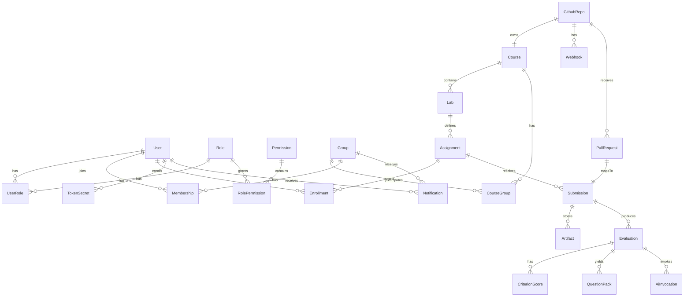

# ERD — модель данных платформы

Диаграмма охватывает курсы, группы, студентов, задания, отправки (PR), оценки, интеграции GitHub и артефакты AI.

## Ключевые сущности (кратко)

- User(id, name, email)
- Group(id, name)
- Membership(userId, groupId, roleInGroup)
- Course(id, title, semester)
- CourseGroup(courseId, groupId)
- Lab(id, courseId, title, requirementsUrl, deadline)
- Assignment(id, labId, rubricVersionId, repoTemplate)
- Enrollment(userId, assignmentId, status)
- Submission(id, assignmentId, studentId, prUrl, commit, status, score)
- Artifact(id, submissionId, path, url, kind)
- Evaluation(id, submissionId, rubricVersion, completedAt, modelSnapshot, summary)
- CriterionScore(id, evaluationId, criterionId, weight, value, max, comments, aiAssisted)
- QuestionPack(id, evaluationId, questionsJson, visibleToStudent)
- GithubRepo(id, courseId, org, name, url)
- Webhook(id, repoId, event, targetUrl)
- PullRequest(id, repoId, number, head, base, url, author)
- AiInvocation(id, evaluationId, modelKey, provider, inputHash, outputRef, latencyMs, cost)
- TokenSecret(id, ownerUserId, kind, scope, createdAt, expiresAt)
- Notification(id, targetUserId?, targetGroupId?, channel, payload, status)

## Замечания по нормализации

- Рубрики и версии рубрик — отдельные таблицы (см. grading/rubric-model.md)
- PR ↔ Submission — 1:1 для простоты, при повторной отправке создаётся новый Submission
- QuestionPack хранит вопросы в JSON (также истории версий по желанию)
