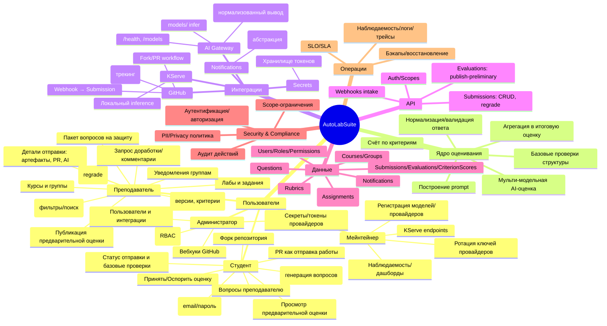
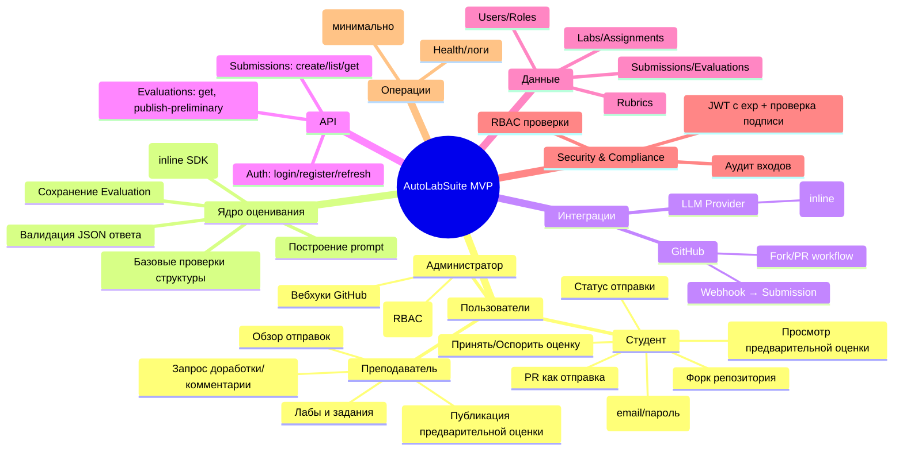

# Диаграмма фич AutoLabSuite

Карта ключевых возможностей системы, сгруппированных по ролям и подсистемам. Диаграмма предназначена для быстрого ориентирования по объёму фич и их связям.

Примечание: если mindmap не рендерится в вашей среде, скажите — добавлю альтернативную версию (flowchart) в этом же файле.

## Диаграмма фич (MVP)

Минимальный набор возможностей для запуска Phase 1 (Inline Adapter).

