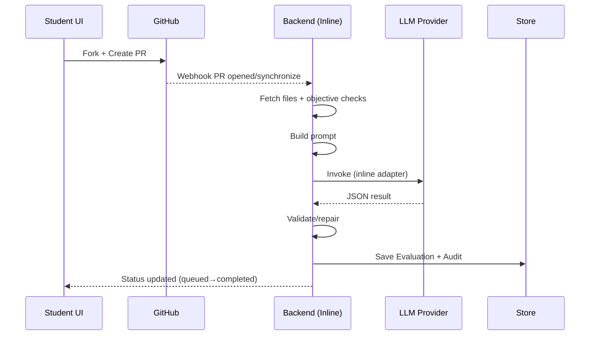
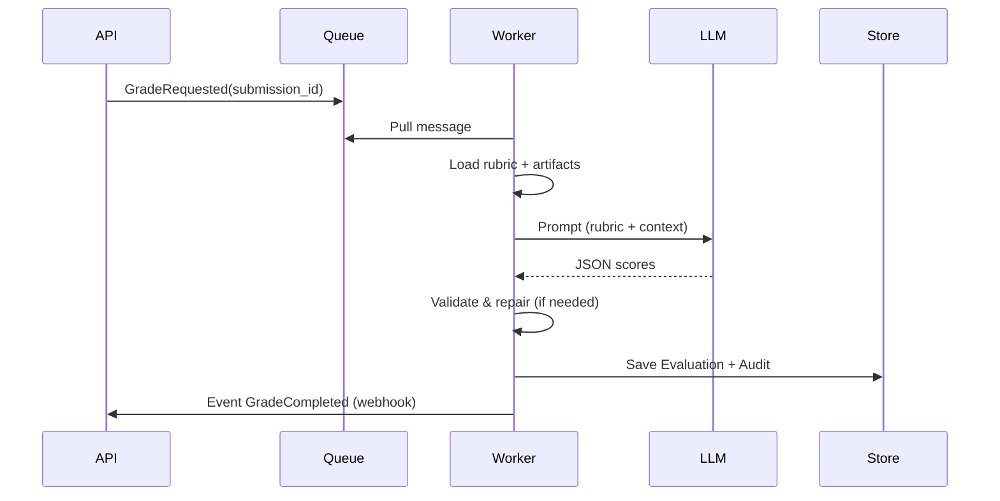

# Модуль градинга и эволюция архитектуры

## Цель документа

Чётко описать поэтапное развитие подсистемы автоматизированной проверки (grading) — от простого встроенного вызова модели до
масштабируемой асинхронной оркестрации с RAG и ансамблями. Документ служит ориентирами для технических решений и планирования
спринтов.

## Область

Покрывает только подсистемы связанные с вычислением оценок: получение submission, подготовка контекста, вызовы моделей,
агрегирование критериев, хранение результатов, повторная переоценка.

---

## Фаза 0 — Основы (подготовка перед MVP)

"Нулевой" этап для закладки инвариантов.

| Аспект | Решение |
|--------|---------|
| Версионирование | rubric_version, prompt_version, model_version фиксируются в каждой Evaluation записи |
| Формат вывода | Строгий JSON Schema (criteria[], overall, meta, audit) |
| Аудит | Сохранение сырого prompt, ответа модели, токенов |
| Безопасность | Очистка PII, лимиты размера артефактов |
| Идемпотентность | submission_id + rubric_version + model_version образуют ключ кэширования |

Выходные артефакты: schema (Pydantic/YAML), базовый audit logger.

---

## Фаза 1 — MVP (Inline Adapter)

Простой встроенный адаптер внутри backend (например, в Grading Core или временно в API слой).

### Поток

1. Получение Submission.
2. Извлечение rubric.
3. Генерация prompt (template + rubric + формат JSON).
4. Вызов выбранной LLM (прямой SDK).
5. Парсинг / попытка восстановления формата.
6. Сохранение Evaluation + Audit.

### UX‑принципы для Phase 1

- Минимум шагов и терминов: без необходимости CLI/терминала в UI; все ссылки ведут на готовые экраны GitHub.
- Пошаговый мастер «Сдать лабу» в интерфейсе студента с автоматическими проверками (по вебхуку PR).
- Наглядные примеры структуры проекта (копируемое дерево, примеры файлов, README-шаблон).
- Ясные ошибки на «человеческом языке»: что не так, где исправить, ссылка на пример.
- Приложение показывает ссылки-подсказки на GitHub (репозиторий, страница сравнения для PR); форк и PR выполняются вручную на GitHub.

### UI hooks и состояния (MVP Inline)

Состояния, которые должен уметь показывать UI при inline‑вызове модели:

1. Получение PR артефактов (queued → fetching)
1. Базовые проверки структуры (checking: directories/files)
1. Подготовка prompt (building prompt)
1. Вызов модели (calling LLM)
1. Парсинг/восстановление ответа (validating JSON)
1. Сохранение результатов (persisting)
1. Готово / Ошибка (completed/failed)

Для каждого шага — компактный лог, индикатор статуса и «что делать, если ошибка».

### Минимальные объективные проверки (до ИИ)

- Проверка на директорию/файлы (пример WT-AC-2025):
    - существует каталог required_dir?
    - присутствуют обязательные файлы (например, index.html, report.md)?
- Валидация README: есть краткое описание и инструкция запуска.
- Ограничение размера артефактов и числа файлов (чтобы не «утонуть»).

Если проверка не пройдена — формадайте понятный отчёт: «Не найдена директория X. Откройте пример: <ссылка>.»

### Поток (Студент — Phase 1)

1. Открывает страницу лабы → жмёт «Начать».
1. Входит локально (email/пароль). При необходимости указывает GitHub username или привязывает аккаунт для PR‑воркфлоу.
1. Открывает репозиторий на GitHub по ссылке из приложения и выполняет форк вручную.
1. Открывает страницу сравнения (compare) на GitHub по ссылке и вручную создаёт Pull Request.
1. После создания PR — вебхук создаёт Submission; студент видит статус «В очереди» и ссылки на PR.
1. При провале минимальных проверок — список конкретных проблем и как исправить.

### Поток (Преподаватель)

1. Видит новые Submission с ссылками на PR и статусами.
1. Открывает Submission → вкладка «AI (MVP)» с пошаговыми стадиями и мини‑логом.
1. Кнопка «Опубликовать предварительную оценку» — делает видимым результат студенту.
1. Кнопка «Запросить доработку» — создаёт шаблонный комментарий в PR.

### Пример последовательной диаграммы (MVP Inline)

### Тексты ошибок (MVP)

- «Не найдена директория X. Откройте пример структуры и создайте каталог.»
- «Обязательный файл Y отсутствует. Скопируйте шаблон из примера.»
- «Ответ модели некорректного формата — идёт повторная попытка. Если не удастся, обратитесь к преподавателю.»

### Критерии готовности (Phase 1)

- Отправка через PR видна в UI без ручного ввода.
- Минимальные проверки запускаются автоматически и дают понятные подсказки.
- Результат ИИ сохраняется и скрыт для студента до публикации преподавателем.
- Есть простая кнопка «Опубликовать предварительную оценку».

### Плюсы (Фаза 2)

- Быстрый старт.
- Минимум инфраструктурных зависимостей.

### Минусы (Фаза 2)

- Смешение доменной и LLM логики.
- Сложно масштабировать разные модели.

### Критерии выхода в следующую фазу

- > N (напр. 200) оценок/день.
- Нужна смена/миграция модели без деплоя основного backend.
- Требование отдельного SLA.

---

## Фаза 2 — Вариант B: Отдельный AI Gateway / Scoring Service

Выделяем сервис `services/ai-gateway` (REST/gRPC: POST /grade).

### Внутренние компоненты

| Компонент | Назначение |
|-----------|------------|
| Provider Adapters | OpenAI / Anthropic / Local / HuggingFace |
| Normalizer | Очистка, усечение, chunking |
| Cache Layer | Повторные запросы грамотно переиспользуются |
| Output Validator | JSON Schema + auto-repair шаг |
| Metrics & Tracing | Latency, retries, cost per eval |
| Audit Store | Хранение prompt/response + hash рубрики |

### Плюсы

- Изоляция ответственности.
- Горизонтальное масштабирование независимо от остального backend.

### Минусы

- Дополнительный деплой, мониторинг, алерты.
- Необходимость формализации SLA/контрактов.

### Технические решения

- gRPC для внутренней низкой латентности (опционально REST).
- Feature flags для переключения провайдеров.

### Критерии перехода дальше

- Пик > X одновременных запросов вызывает очереди ожидания.
- Появляется потребность в отложенных тяжёлых заданиях (ensemble, regrade bulk).

---

## Фаза 3 — Асинхронный пайплайн (Очередь + Worker)

Переход к отложенной обработке: backend кладёт задачу в очередь, worker обрабатывает и пишет результат.

### Поток (Фаза 3)

1. API → Command (GradeRequested) в очередь (Kafka/SQS/RabbitMQ).
2. Worker подтягивает задание, извлекает контекст.
3. Пошаговый pipeline (rule checks → LLM scoring → aggregation).
4. Запись Evaluation + публикация события GradeCompleted.
5. UI подписывается через polling/webhook/stream.

### Плюсы (Фаза 3)

- Устойчивость к пикам (buffer в очереди).
- Ретраи без дубликатов (visibility timeout / dedup key).
- Легко добавлять тяжёлые шаги (несколько моделей, cross-eval).

### Минусы (Фаза 3)

- Сложнее трассировка end-to-end.
- Требуются явные принципы идемпотентности и DLQ.

### Ключевые компоненты

| Компонент | Роль |
|-----------|-----|
| Queue | Хранит задания (GradeRequested) |
| Worker Fleet | Масштабируемые исполнители |
| Pipeline Orchestrator | Управляет этапами |
| DLQ Handler | Анализ невосстановимых ошибок |
| Regrade Scheduler | Периодические переоценки (drift) |

### Метрики

- queue_depth, processing_latency_p50/p95
- failure_rate, repair_attempts_avg
- cost_per_evaluation

### Критерии перехода дальше (после Фазы 3)

- Требование улучшения качества через контекст и ансамбли.
- Нужен explainability layer (пример-ориентированный контекст).

---

---
Ввод нескольких моделей для разных аспектов + частичный переход на локальные (GPU) для стоимости.

| Подмодуль | Назначение |
| Aspect Model (Стиль) | Комментарии, читаемость |
| Local Model Runner | Запуск локальных LLM (через vLLM/llama.cpp) |
| Aggregator | Взвешенное объединение оценок |

### Ключевые вызовы

- Согласование шкал разных моделей.
- Контроль дрейфа локальных моделей.

---

## Поперечные требования (сквозно через фазы)

| Область | Требование |
| Observability | OpenTelemetry traces + метрики per step |
| Security | Sandbox + ограничение входного контента |
| Privacy | Обфускация PII до отправки в внешние API |
| Compliance | Логирование доступа к оценкам |
| Prompt Governance | Чёткое хранение всех версий + diff просмотр |
| Cost Management | Token cost dashboard, буджетные алерты |

---

## Пример последовательной диаграммы (Фаза 3)

---

## Решения по выбору технологий (предварительно)

| Задача | Варианты | Ранний выбор |
|--------|----------|--------------|
| Очередь | RabbitMQ / SQS / Kafka | SQS (простота) или RabbitMQ on-prem |
| Vector Store | PGVector / Chroma / Weaviate | Postgres + PGVector |
| Local LLM Runtime | vLLM / llama.cpp / Ollama | vLLM (пропускная способность) |
| Output Validation | Свой парсер / LangChain OutputParser | Свой + опционально LangChain позже |
| Metrics | Prometheus + Grafana | Да |
| Tracing | OTEL Collector | Да |

---

## Критерии качества (Quality Gates)

- < 1% irrecoverable parse failures за неделю
- p95 latency (MVP): <= 8s sync; (Async): обработка < 2 мин при очереди < 50
- Drift alert: изменение среднего балла > 10% за 24ч при стабильном потоке
- Coverage: >= 95% submissions проходят objective checks до LLM шага

---

## Roadmap сводка

| Фаза | Оценка усилий | Основной результат |
|------|---------------|--------------------|
| 1 (MVP) | 2-3 спринта | Inline adapter + audit + schema |
| 2 (Gateway) | 2 спринта | Выделенный сервис + кэш + метрики |
| 3 (Async) | 2-3 спринта | Очередь + workers + идемпотентность |
| 4 (RAG) | 2 спринта | Векторный контекст + динамический prompt |
| 5 (Ensemble/Local) | 3+ спринта | Мульти-модели + cost optimization |

---

## Связанные документы

- `solution-architecture.md`
- `../grading/rubric-model.md`
- `../ai-models/model-strategy.md`
- `../decision-records/adr-001-initial-stack.md`

## ToDo / Открытые вопросы

- Нужен ADR по выбору очереди.
- Нужен ADR по стратегиям повторной переоценки (regrading triggers).
- Нужна схема БД для audit/event таблиц.
