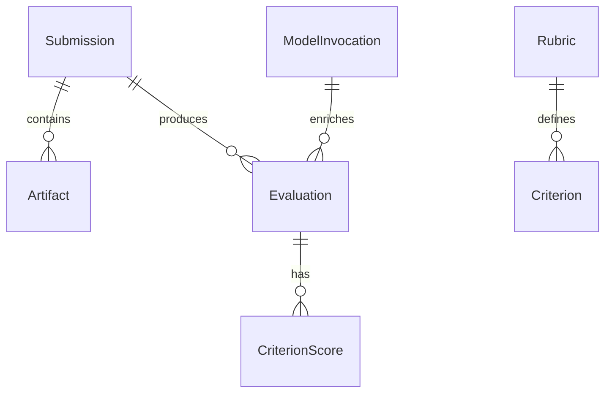

# Архитектура решения (обзор)

## Цели архитектуры

- Надёжное воспроизводимое оценивание
- Прозрачность и трассируемость (audit trail)
- Расширяемость (подключение новых проверок и моделей)
- Наблюдаемость и эксплуатационная простота

## Высокоуровневые компоненты

| Компонент | Ответственность |
|-----------|------------------|
| Ingestion Service | Приём submission (webhook, upload), нормализация артефактов |
| Grading Core | Оркестрация проверок, агрегация рубрик |
| Test Runner Sandbox | Изолированное выполнение кода студента |
| AI Assistance Service | Адаптеры LLM, эмбеддинги, пост-обработка ответов |
| Feedback Generator | Формирование текстов обратной связи и отчётов |
| Storage Layer | S3/DB хранение артефактов и метаданных |
| Audit & Trace | Логирование действий, событий пайплайна |
| API Gateway | Экспорт REST/GraphQL для UI/LMS |
| UI / Portal | Дашборды преподавателя и студента |

## Поток данных (упрощённо)

1. Git push → Webhook → Ingestion
2. Скачивание репозитория → упаковка Submission
3. Планирование задач → очередь → Test Runner
4. Сбор результатов тестов + статический анализ → Grading Core
5. Запросы к AI (контекст: фрагменты кода, метрики) → ответы
6. Слияние рубрик + AI объяснений → Feedback
7. Запись Evaluation + отчёт → Storage + Notification

## Модель данных (эскиз)



## Ключевые технические решения

- Модульный монолит со слоями (ingestion, grading, ai, api)
- Событийная шина (event table / outbox на старте)
- OpenTelemetry для трассировки пайплайна
- Песочница: контейнеры с ограничением ресурсов (future)

## Расширяемость

Новые проверки → плагин интерфейс (например, Python entrypoint / динамическая загрузка) с контрактом:

```text
check(input: SubmissionContext) -> CriterionScore
```

## Наблюдаемость

- Traces: цепочка submission → evaluation
- Metrics: время оценки, ошибки моделей, латентность
- Logs: структурированные JSON, correlation id

## Безопасность (эскиз)

- Изоляция выполнения студенческого кода
- Ограничение исходящих сетевых запросов
- Шифрование чувствительных данных в хранилище

## Открытые вопросы

- Формат унификации разных языков программирования
- Политика кэширования AI ответов
- Версионность рубрик

## Связанные документы

- `../decision-records/adr-001-initial-stack.md`
- `../grading/rubric-model.md`
- `../ai-models/model-strategy.md`
- `grading-module.md`
